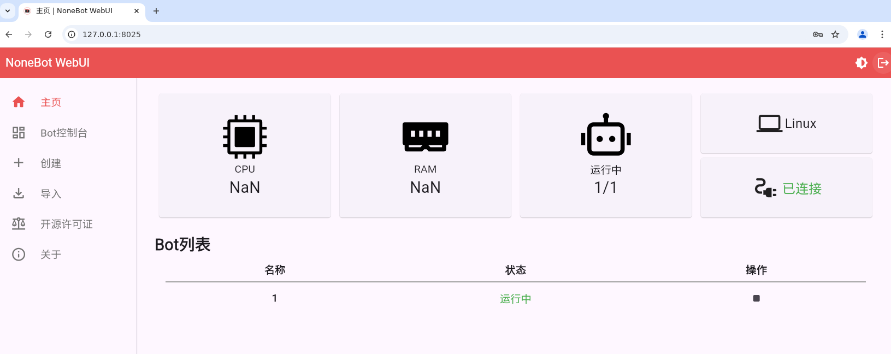
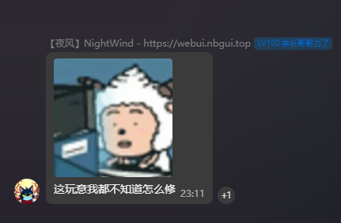

# NoneBot-Webui-Docker

<div align="center">
  <br>
</div>

<div align="center" style="font-size:20px;">
    ✨ NoneBot Webui Docker安装版本 ✨
</div>

[DockerHub](https://hub.docker.com/r/myxuebi/nonebot-webui)

## ⚙️安装容器
### 命令行安装运行 （推荐）
```shell
sudo docker run -d  \
    -p 8025:8025 \
    -p 2519:2519 \
    -v /opt/nb-webui:/data \
    --name nonebot-webui \
    --restart=always \
    myxuebi/nonebot-webui:latest
```
镜像WebUI初始密码为：123456 

需修改看下面配置

### Dockerfile 自构建运行
```shell
git clone https://github.com/NonebotGUI/nonebot-webui-docker
cd nonebot-webui-docker
sudo docker build -t nonebot-webui .
sudo docker run -d -p 8025:8025 -p 2519:2519 -v /opt/nb-webui:/data nonebot-webui
```

## 📑 配置
### 修改密码
1.在 /opt/nb-webui/dashboard/config.json 和 /opt/nb-webui/agent/config.json 内的password值内修改 

2. sudo docker restart nonebot-webui 重启服务就可以修改成功

### 修改配置文件
已挂载到本地

dashboard配置文件：/opt/nb-webui/dashboard/config.json 

agent配置文件：/opt/nb-webui/agent/config.json

## 🖼️ 登录
WebUI地址：http://<宿主机IP>:8025/

## ⚠️ 已知问题
在 protocol 模式下（默认） 有可能出现CPU、内存无法显示正常值的情况
 


需要静等作者修复~ 

但是好像得等等了？ 

